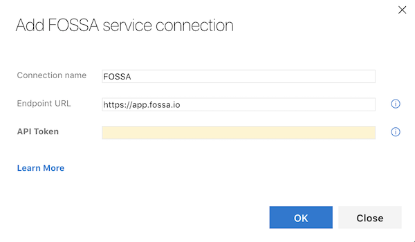
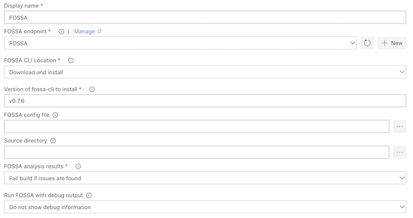

# FOSSA Integration for Azure DevOps and Team Foundation Server
This plugin allows you to integrate FOSSA to automatically detect all of your open source dependencies, and alert you in real-time about licensing policy violations and security vulnerabilities.

## Getting Started
1. Create a free [FOSSA account](https://app.fossa.io/)
2. Install this extension
3. Open your Team Services project settings page, and click the 'services' tab
4. Click 'New Service Endpoint' and choose FOSSA. You should see a screen like this

5. Get an API Token from the [Integration Settings](https://app.fossa.io/account/settings/integrations/api_tokens) on FOSSA
6. Name your connection, add the FOSSA API URL, and copy in your API Token from FOSSA
7. You can now add the FOSSA build task to your build definition and configure it

